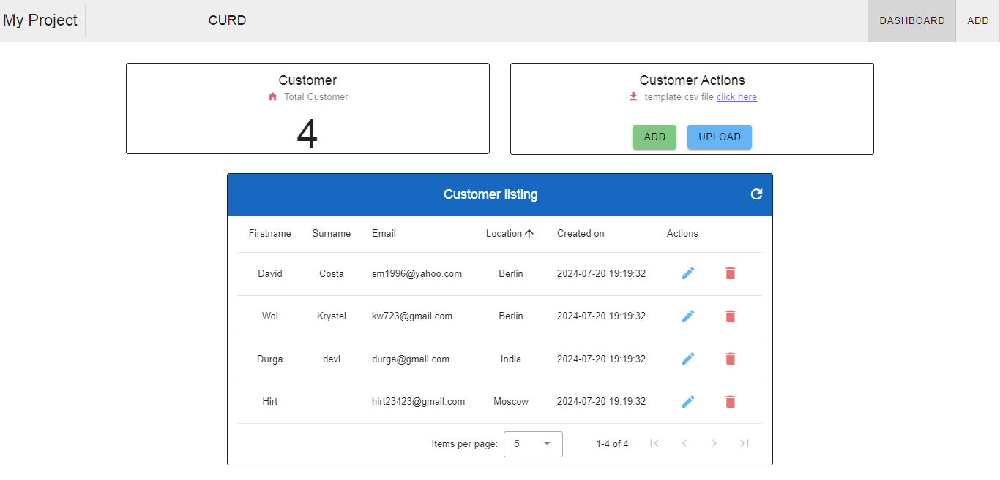
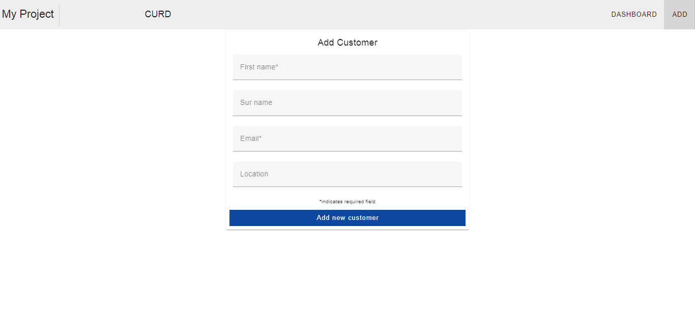

### Project info
Front end : Vue3 CURD
Back end API: PHP
DB : mysql

# vue3-curd-vuetify
How to build a Vue 3 reactive component with vuetify using PHP API and mysql.

This is my project of Basic CURD actions using Vue3 using v-data-table-server with API request using PHP

This project contains Create customer, Edit customer, Delete customer and update customer information using v-data-table-server to display list of customer 





### PHP file path: vue3-curd-vuetify/PHP_API
### sql structure path: vue3-curd-vuetify/PHP_API/myproject.sql

## Vue Project setup
```
npm install
```

### Compiles and hot-reloads for development
```
npm run serve
```

### Compiles and minifies for production
```
npm run build
```

### Customize configuration
See [Configuration Reference](https://cli.vuejs.org/config/).
